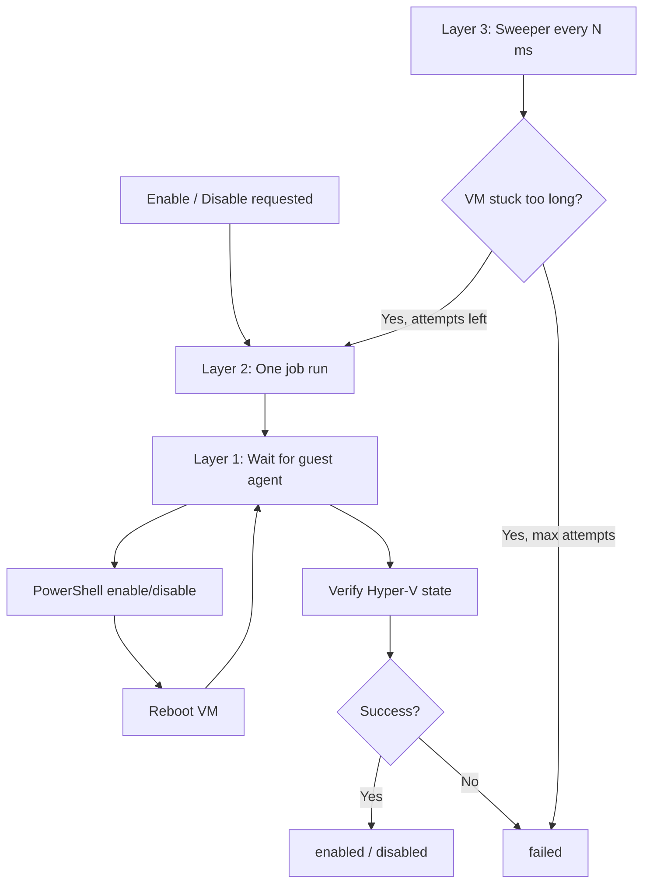

# Hyper-V environment variables

Reference for all `HYPERV_*` settings in `core-api/.env`. These control nested virtualization (Hyper-V inside Windows guests) on Proxmox: guest-agent waits, enable/disable job timeouts, background recovery, and concurrency.

All values are **milliseconds** unless noted. If a variable is omitted from `.env`, the **default** in the table below is used. After any change, **restart core-api**.

---

## Quick copy-paste block

```env
# ─── Hyper-V / nested virtualization (Windows guests) ─────────────────────────

# Layer 1 — guest agent
HYPERV_AGENT_READY_TIMEOUT_MS=300000
HYPERV_AGENT_POLL_MS=5000

# Layer 2 — one enable/disable run
HYPERV_EXEC_DEADLINE_MS=1200000
HYPERV_EXEC_POLL_MS=3000
HYPERV_POST_REBOOT_SETTLE_MS=20000

# Layer 3 — sweeper (stuck job recovery)
HYPERV_SWEEPER_INTERVAL_MS=120000
HYPERV_STUCK_PENDING_MS=300000
HYPERV_STUCK_INPROGRESS_MS=300000
HYPERV_MAX_SWEEPER_ATTEMPTS=3

# Concurrency (not a retry layer)
HYPERV_MAX_CONCURRENT=3
```

---

## How the three retry layers work

Hyper-V provisioning is **not** “3 pings then stop.” There are three separate mechanisms:

| Layer | What it does | Controlled by |
|-------|----------------|---------------|
| **1 — Guest agent wait** | Pings QEMU guest agent inside the VM until it responds | Timeout + poll interval |
| **2 — One enable/disable run** | Full flow: PowerShell → reboot → verify (survives agent drops within one budget) | Wall-clock deadline + poll intervals |
| **3 — Sweeper** | Background job that re-starts VMs stuck in `pending` / `enabling` / `disabling` | Stuck thresholds + max attempt **count** |

Only **Layer 3** uses an explicit retry **count** (`HYPERV_MAX_SWEEPER_ATTEMPTS`). Layers 1 and 2 use **time budgets** (keep trying until timeout).



---

## Layer 1 — Guest agent

The provisioner must talk to the **QEMU guest agent** inside the Windows VM (via Proxmox API). After start or reboot, Windows may take minutes before the agent is ready.

### `HYPERV_AGENT_READY_TIMEOUT_MS`

| | |
|---|---|
| **Default** | `300000` (5 minutes) |
| **Unit** | Milliseconds |
| **Meaning** | Maximum time to wait for the guest agent to answer a ping **for one wait phase**. Each call to “wait for agent” (after start, after reboot, before exec) gets its **own** 5-minute window. |
| **Not** | A fixed number of ping attempts. The code pings every `HYPERV_AGENT_POLL_MS` until this timeout. |

**When to increase:** Slow or small Windows VMs where boot + agent startup often exceeds 5 minutes.

**Suggested production tweak (slow VMs):** `600000` (10 minutes)

---

### `HYPERV_AGENT_POLL_MS`

| | |
|---|---|
| **Default** | `5000` (5 seconds) |
| **Unit** | Milliseconds |
| **Meaning** | Delay between guest-agent ping attempts while waiting within `HYPERV_AGENT_READY_TIMEOUT_MS`. |

**Example:** With defaults, up to ~60 ping attempts per wait phase (5 min ÷ 5 sec).

**When to change:** Usually leave at `5000`. Lower values increase Proxmox API load; higher values slow detection when the agent comes up.

---

## Layer 2 — One enable/disable run

One background job covers the full operation: ensure VM is running → wait for agent → pre-check state → run PowerShell → reboot → wait → verify.

### `HYPERV_EXEC_DEADLINE_MS`

| | |
|---|---|
| **Default** | `1200000` (20 minutes) |
| **Unit** | Milliseconds |
| **Meaning** | **Wall-clock budget** for a single guest PowerShell command (including re-wait and re-issue if the agent drops mid-command, e.g. during Windows first-boot reboot). |

This is the most important tuning knob for slow machines.

**When to increase:** Jobs fail with messages like “Guest command did not complete” on VMs with slow disks, low CPU/RAM, or long `Enable-WindowsOptionalFeature` runs.

**Suggested production tweak (slow VMs):** `1800000` (30 minutes)

If you increase this, consider increasing `HYPERV_STUCK_INPROGRESS_MS` (Layer 3) so the sweeper does not treat long-running jobs as stuck too early.

---

### `HYPERV_EXEC_POLL_MS`

| | |
|---|---|
| **Default** | `3000` (3 seconds) |
| **Unit** | Milliseconds |
| **Meaning** | How often to poll Proxmox `agent/exec-status` while a PowerShell command is running. Also used as backoff between exec **start** retries when the agent is temporarily unavailable. |

---

### `HYPERV_POST_REBOOT_SETTLE_MS`

| | |
|---|---|
| **Default** | `20000` (20 seconds) |
| **Unit** | Milliseconds |
| **Meaning** | Fixed pause after the reboot task completes, **before** starting the next guest-agent wait. Gives Windows a moment to begin booting. |

The agent wait loop (Layer 1) still runs after this; this is not the full post-reboot wait.

**When to increase:** Very slow boots; optional tweak `45000`–`60000` (45–60 sec).

---

## Layer 3 — Sweeper (stuck job recovery)

A timer inside **core-api** (not Proxmox health checks) scans MongoDB for VMs whose Hyper-V status has not progressed for too long—for example after an API restart or a crashed background job.

### `HYPERV_SWEEPER_INTERVAL_MS`

| | |
|---|---|
| **Default** | `120000` (2 minutes) |
| **Unit** | Milliseconds |
| **Meaning** | How often the sweeper runs. |

---

### `HYPERV_STUCK_PENDING_MS`

| | |
|---|---|
| **Default** | `300000` (5 minutes) |
| **Unit** | Milliseconds |
| **Meaning** | A VM in status **`pending`** (bulk create, waiting to start enable) is treated as stuck if `hyperVStatusChangedAt` (or `updatedAt` for legacy rows) is older than this. |

**Bulk create note:** With `HYPERV_MAX_CONCURRENT=3`, if you create many VMs with virtualization at once, VMs **4+** may stay `pending` longer than 5 minutes **only because they are waiting for a concurrency slot**. The sweeper may retry them early (usually harmless). For large bulk jobs, increase this value.

**Suggested tweak (many bulk Hyper-V VMs):** `900000` (15 minutes) or higher.

---

### `HYPERV_STUCK_INPROGRESS_MS`

| | |
|---|---|
| **Default** | `300000` (5 minutes) |
| **Unit** | Milliseconds |
| **Meaning** | A VM in **`enabling`** or **`disabling`** is treated as stuck if its lock has expired (crashed provisioner) and `hyperVStatusChangedAt` is older than this. |

A live provisioner renews its lock on a heartbeat, so in-flight jobs are not flagged until the lock is free **and** the status has been unchanged for this grace period.

**Suggested tweak (slow VMs or long exec runs):** `900000` (15 minutes) or higher.

---

### `HYPERV_MAX_SWEEPER_ATTEMPTS`

| | |
|---|---|
| **Default** | `3` |
| **Unit** | Count (not milliseconds) |
| **Meaning** | Maximum number of times the sweeper may **auto-retry** a stuck VM before setting status to **`failed`** with a message to retry manually from the VM detail page. |

Each sweeper retry increments `hyperVAttemptCount` on the VM document. Manual **Retry enable** or a new enable/disable from the API **resets** the counter to 0.

**This is not:** “Ping Proxmox 3 times.” It is “restart the stuck Hyper-V job up to 3 times.”

**When to increase:** Only if legitimate jobs often need many sweeper recovery cycles (flaky environment). Values like `15` mean broken VMs may retry for **hours** before showing failed.

**Recommended:** Keep at `3` unless you have measured need for more.

---

## Concurrency (related, not a retry layer)

### `HYPERV_MAX_CONCURRENT`

| | |
|---|---|
| **Default** | `3` |
| **Unit** | Count |
| **Meaning** | Maximum number of Hyper-V enable/disable jobs running **at the same time** in this core-api process (in-memory semaphore). |

Bulk-created VMs wait in `pending` until a slot is free.

**When to lower:** Small Proxmox host, slow Windows templates, or heavy load during parallel enables. `1` or `2` reduces host stress.

**When to raise:** Powerful host and fast templates; use cautiously on a single node.

**Multi-instance note:** This limit applies **per core-api instance**, not cluster-wide. Horizontal scaling requires a shared queue (e.g. Redis)—not covered by these env vars.

---

## Complete variable reference

| Variable | Default | Layer | Type |
|----------|---------|-------|------|
| `HYPERV_AGENT_READY_TIMEOUT_MS` | 300000 | 1 | Timeout |
| `HYPERV_AGENT_POLL_MS` | 5000 | 1 | Interval |
| `HYPERV_EXEC_DEADLINE_MS` | 1200000 | 2 | Timeout |
| `HYPERV_EXEC_POLL_MS` | 3000 | 2 | Interval |
| `HYPERV_POST_REBOOT_SETTLE_MS` | 20000 | 2 | Delay |
| `HYPERV_SWEEPER_INTERVAL_MS` | 120000 | 3 | Interval |
| `HYPERV_STUCK_PENDING_MS` | 300000 | 3 | Stuck threshold |
| `HYPERV_STUCK_INPROGRESS_MS` | 300000 | 3 | Stuck threshold |
| `HYPERV_MAX_SWEEPER_ATTEMPTS` | 3 | 3 | Retry count |
| `HYPERV_MAX_CONCURRENT` | 3 | — | Concurrency |

There are **no other** `HYPERV_*` variables in core-api.

---

## Production recommendations

### Standard production (defaults)

The quick copy-paste block at the top is appropriate for:

- Single core-api instance
- Windows templates with QEMU guest agent installed
- Proxmox host with nested virtualization configured
- Moderate VM count and bulk sizes

### Small / slow Windows VMs

```env
HYPERV_AGENT_READY_TIMEOUT_MS=600000
HYPERV_EXEC_DEADLINE_MS=1800000
HYPERV_POST_REBOOT_SETTLE_MS=45000
HYPERV_MAX_CONCURRENT=1
HYPERV_STUCK_INPROGRESS_MS=900000
```

### Large bulk create (many Hyper-V VMs at once)

```env
HYPERV_STUCK_PENDING_MS=900000
HYPERV_MAX_CONCURRENT=2
```

---

## Troubleshooting

| Symptom | Likely cause | Try |
|---------|----------------|-----|
| “Guest agent did not respond” | Agent not installed, VM not booted, or boot too slow | Increase `HYPERV_AGENT_READY_TIMEOUT_MS`; verify guest agent in template |
| “Guest command did not complete” | Job exceeded exec deadline or permanent Proxmox/guest error | Increase `HYPERV_EXEC_DEADLINE_MS`; check `hyperVLastError` and core-api logs |
| Stuck on **Pending** for a long time | Concurrency queue full | Normal if many VMs; increase `HYPERV_STUCK_PENDING_MS` or `HYPERV_MAX_CONCURRENT` |
| **Failed** after long time, sweeper message | Max sweeper attempts reached | Fix root cause; use **Retry enable** on VM detail page (resets attempt counter) |
| Hyper-V enabled in guest but UI says failed | Rare decode/verify issue | Check logs for `[HyperV]`; verify guest agent output |

---

## Related code (for maintainers)

| Area | Path |
|------|------|
| Config schema | `src/config/index.ts` |
| Provisioner (layers 1–2) | `src/modules/vm/helpers/hypervProvisioner.ts` |
| Queue + concurrency | `src/modules/vm/helpers/hypervQueue.ts` |
| Sweeper (layer 3) | `src/modules/vm/helpers/hypervSweeper.ts` |
| Status timestamps / attempts | `src/modules/vm/helpers/hypervStatus.ts` |
| Example env | `.env.example` |

---

## Prerequisites (not env vars)

These are **operational** requirements, not configured via `HYPERV_*`:

1. **Windows guest** with Hyper-V-capable edition (not Windows Home).
2. **QEMU guest agent** installed and running in the template.
3. **Nested virtualization** enabled on the Proxmox VM / host so Hyper-V can run inside the guest.
4. **Restart core-api** after editing `.env`.
